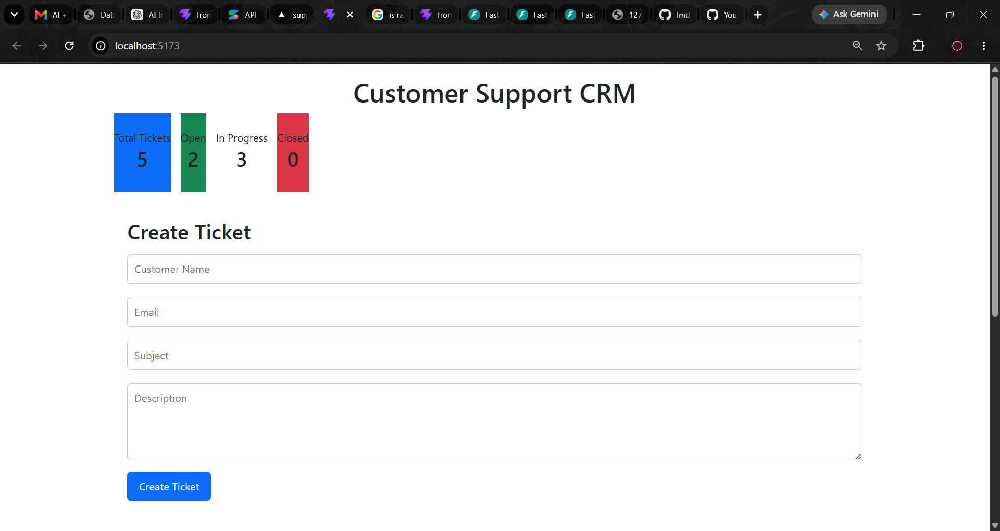
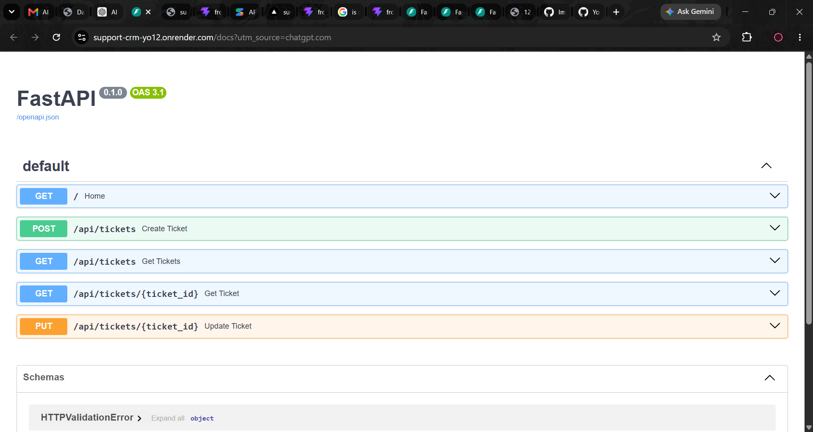
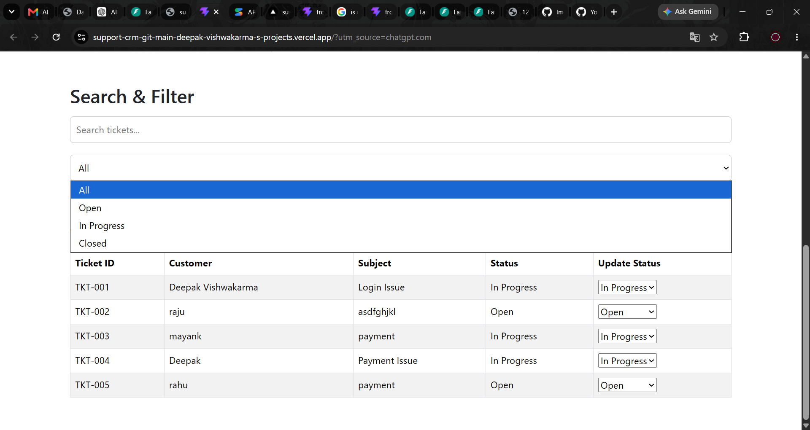

# 🚀 AI-Powered Customer Support CRM

<p align="center">


</p>

---

## 🌐 Live Demo

### Frontend
https://support-crm-git-main-deepak-vishwakarma-s-projects.vercel.app/

### Backend API
https://support-crm-yo12.onrender.com

### Swagger Docs
https://support-crm-yo12.onrender.com/docs

### GitHub
https://github.com/Imdpkk/support-crm

---

## 📌 Project Overview

AI-Powered Customer Support CRM is a full-stack ticket management system that helps organizations manage customer support requests efficiently.

The system provides:

- Ticket Creation
- Ticket Tracking
- Dashboard Analytics
- Search & Filtering
- Status Management
- AI Ticket Analysis

---

## 🎯 Problem Statement

Organizations receive hundreds of support tickets daily.

Common issues:

- Payment Failed
- Login Issues
- Refund Requests
- Account Locked
- Technical Errors

Manual handling results in:

- Slow response times
- Incorrect prioritization
- Poor tracking

---

## ✅ Solution

This CRM system centralizes support operations and enables teams to:

- Manage tickets
- Track ticket lifecycle
- Search and filter requests
- Monitor ticket analytics
- Categorize tickets using AI

---

## ✨ Features

| Feature | Status |
|----------|---------|
| Create Ticket | ✅ |
| Update Status | ✅ |
| Dashboard Analytics | ✅ |
| Search Tickets | ✅ |
| Filter Tickets | ✅ |
| REST API | ✅ |
| AI Ticket Analysis | ✅ |
| Cloud Deployment | ✅ |

---

## 📸 Screenshots

### Dashboard



### Create Ticket



### Ticket Management



---

## 🏗 Architecture

```text
React Frontend
      ↓
Axios
      ↓
FastAPI Backend
      ↓
SQLAlchemy ORM
      ↓
SQLite Database 
---
```md
💻 Tech Stack
Frontend
React
Vite
Axios
Bootstrap
CSS
Backend
Python
FastAPI
Uvicorn
Database
SQLite
SQLAlchemy
Deployment
Vercel
Render
Version Control
Git
GitHub
-----
📡 API Endpoints
Method	Endpoint
POST	/api/tickets
GET	/api/tickets
GET	/api/tickets/{ticket_id}
PUT	/api/tickets/{ticket_id}
POST	/api/analyze-ticket
🧠 AI Ticket Analysis

Example:

Input:

{
  "description": "Payment deducted but order not confirmed"
}

Output:

Category: Payment
Priority: High
Summary: Customer reported a payment-related issue.
----

```md
🚧 Challenges Faced
CORS Issue

Solved using FastAPI CORS Middleware.

Frontend-Backend Communication

Integrated React and FastAPI using Axios.

Deployment

Frontend deployed on Vercel.

Backend deployed on Render.

AI API Quota Issue

Implemented local AI classification logic as fallback.

📈 Future Enhancements
JWT Authentication
Role Based Access Control
Email Notifications
PostgreSQL
File Attachments
Real AI Integration
Admin Dashboard
👨‍💻 Developer

Deepak Vishwakarma

Software Engineering Student | Cloud & AI Enthusiast

<<<<<<< HEAD
GitHub:
https://github.com/Imdpkk
=======
🔗 https://github.com/Imdpkk
>>>>>>> a060abd (Final project submission)
